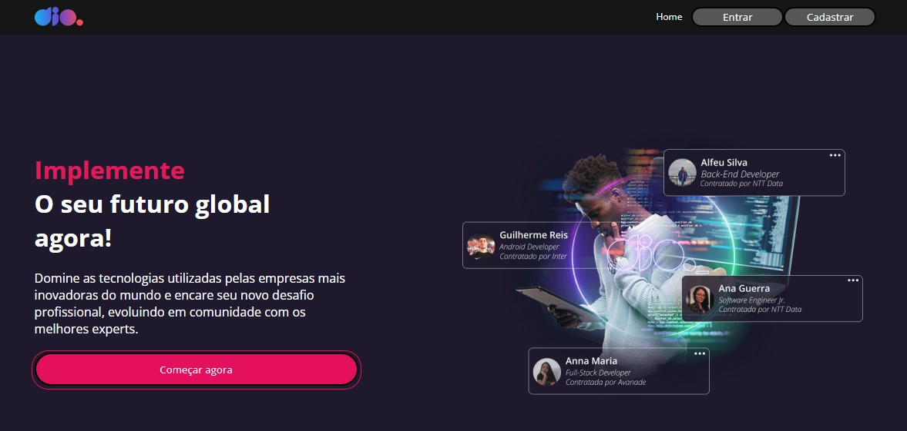
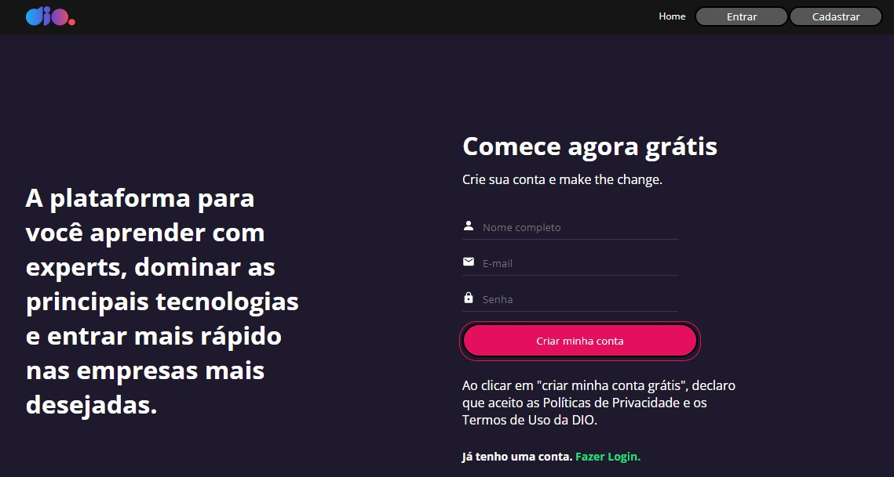
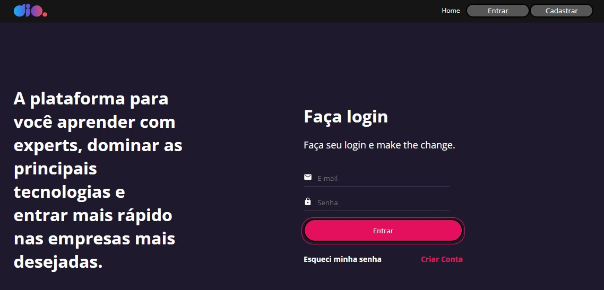
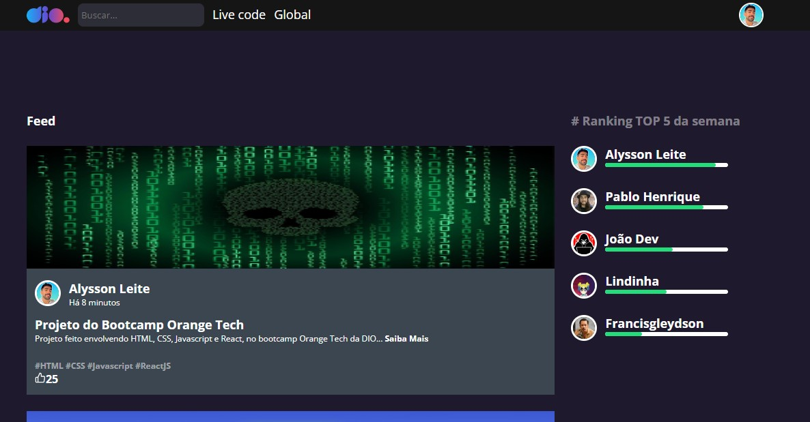
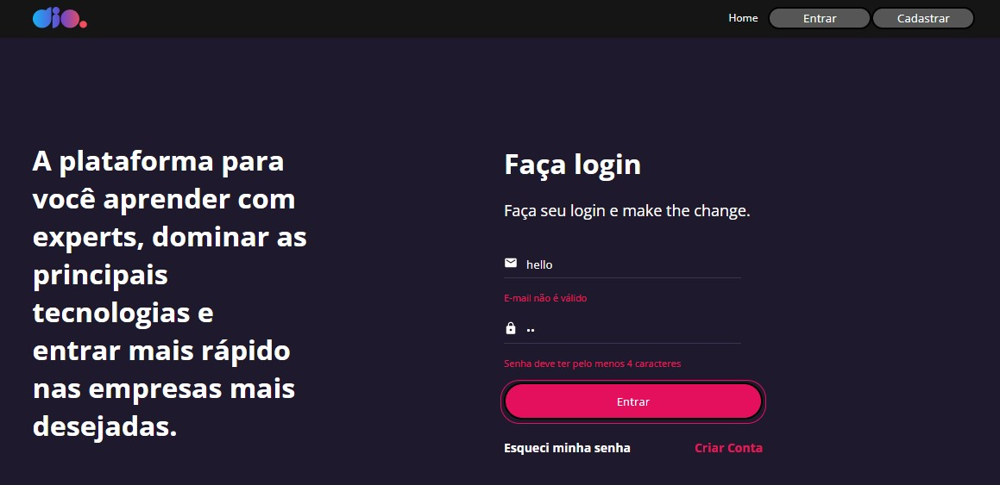

# Página Clone da DIO - Digital Innovation One

> Este projeto foi inicializado com [Create React App](https://github.com/facebook/create-react-app).

Clone da página da DIO utilizando ReactJS para fazer as rotas em Single Page Aapplication, utilizando diversas bibliotecas como: styled-components, react-router-dom, react hook-form, entre outros.







## Deploy

Para fazer o deploy desse projeto rode

```bash
  npm run deploy
```

ou acesse a página abaixo:

[Clone DIO](https://clone-site-dio.netlify.app//)

## Tecnologias
- HTML
- CSS
- JavaScript
- ReactJS
    - styled-components
    - react-router-dom
    - react-icons
    - react-hook-form
    - schema validation do react-hook-form

- Git e Github

## Validação de e-mail e senha

Na página de login, a validação de e-mail e senha foi feita com react-hook-form para que seja colocado um formato de e-mail válido e uma senha com no mínimo 4 caracteres, para validar e seguir para a página de 'feed'.




## O que aprendi

Aprendi a utilizar as bibliotecas do ReactJS para criar rotas e fazer um site Single Page Application (SPA)

Aprendi também a estilizar componentes utilizando styled-components, uma biblioteca que possibilita escrever códigos CSS dentro do JavaScript, ganhando agilidade no desenvolvimento e facilidade na posterior manutenção.

Aprendi ainda a utilizar a a bilbioteca react-hook-form para validar formulários, facilitando a implantação com pouco código escrito e tendo a vantagem de não re-renderizar a cada mudança no valor de um input.

## Contato

[alysson_leite@yahoo.com.br](alysson_leite@yahoo.com.br)

[Linkedin](https://www.linkedin.com/in/alysson-leite-14040a239/)

[Github](https://github.com/alysson-leite)

## Learn More

You can learn more in the [Create React App documentation](https://facebook.github.io/create-react-app/docs/getting-started).

To learn React, check out the [React documentation](https://reactjs.org/).

### Code Splitting

This section has moved here: [https://facebook.github.io/create-react-app/docs/code-splitting](https://facebook.github.io/create-react-app/docs/code-splitting)

### Analyzing the Bundle Size

This section has moved here: [https://facebook.github.io/create-react-app/docs/analyzing-the-bundle-size](https://facebook.github.io/create-react-app/docs/analyzing-the-bundle-size)

### Making a Progressive Web App

This section has moved here: [https://facebook.github.io/create-react-app/docs/making-a-progressive-web-app](https://facebook.github.io/create-react-app/docs/making-a-progressive-web-app)

### Advanced Configuration

This section has moved here: [https://facebook.github.io/create-react-app/docs/advanced-configuration](https://facebook.github.io/create-react-app/docs/advanced-configuration)

### Deployment

This section has moved here: [https://facebook.github.io/create-react-app/docs/deployment](https://facebook.github.io/create-react-app/docs/deployment)

